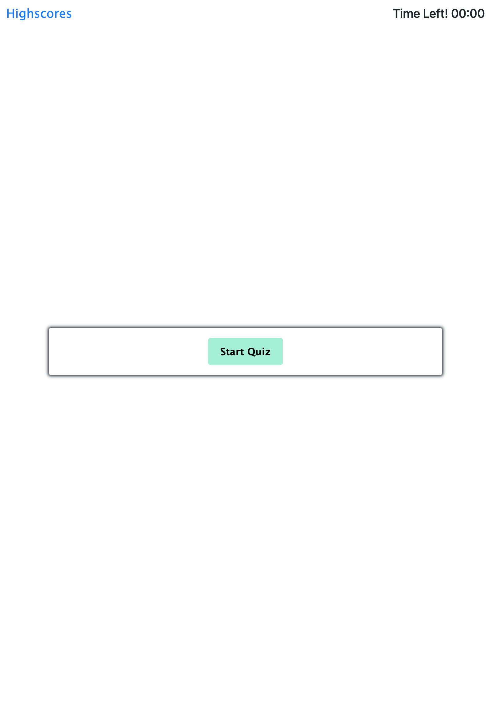
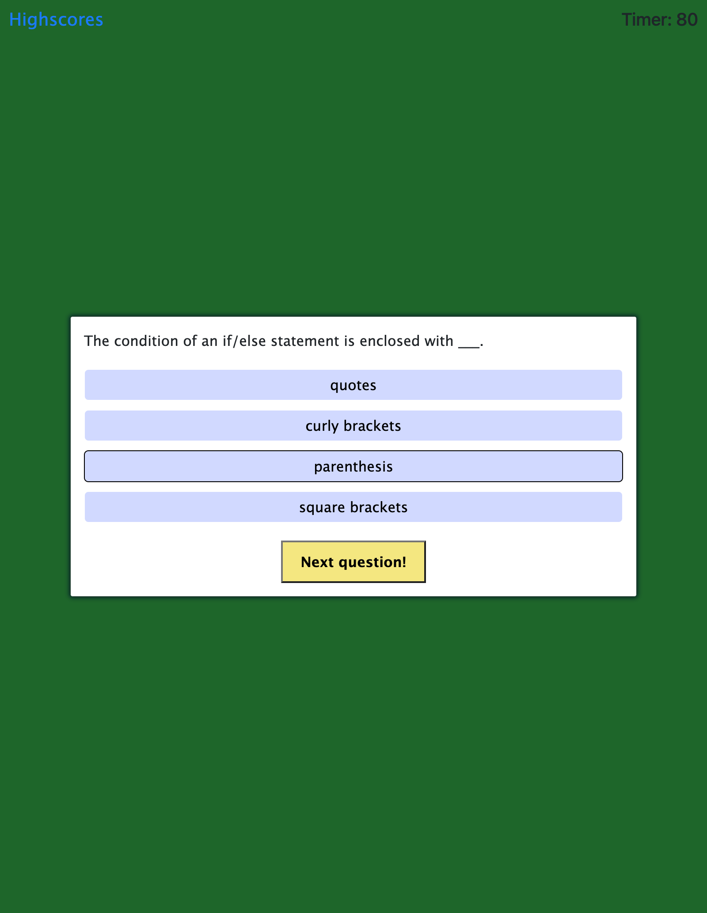
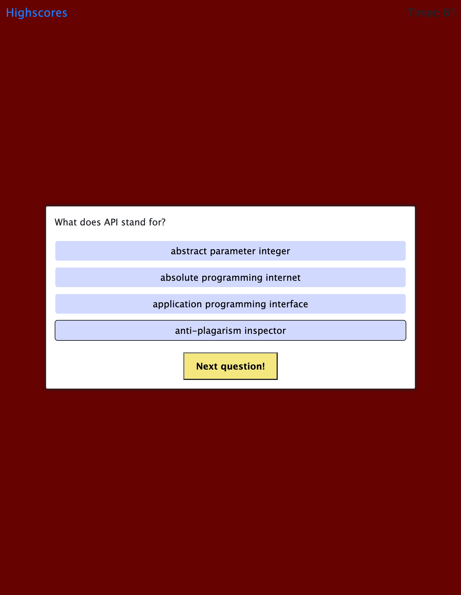
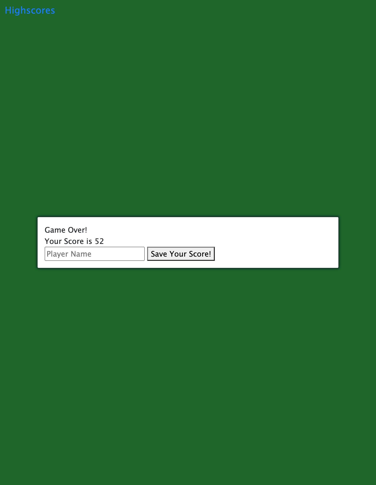

# timed-coding-quiz
A fun, interactive quiz to test your coding knowledge!

## Acceptance Criteria

GIVEN I am taking a code quiz  
WHEN I click the start button  
THEN a timer starts and I am presented with a question  
WHEN I answer a question  
THEN I am presented with another question  
WHEN I answer a question incorrectly  
THEN time is subtracted from the clock  
WHEN all questions are answered or the timer reaches 0  
THEN the game is over  
WHEN the game is over  
THEN I can save my initials and score  

## Link to deployed App
https://ashley1thompson.github.io/timed-coding-quiz/

## How to Play
Click the Start Quuiz button.  
Answer the Quiz question.  
If you answer correctly, the background will show GREEN.  
If you answer incorrectly, the background will show RED and 10 seconds will be removed from the timer.  
When you select the correct answer, click the Next button.  
After you answer all the questions, enter your initials and save your scores to the leaderboard!  
Click the Back to Quiz link to return to Start and try to beat your highscore!  

## Screenshots

The following shows the app functionality:  

## Thanks for Playing!
